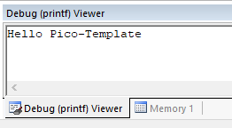
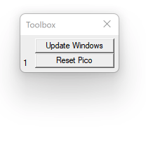
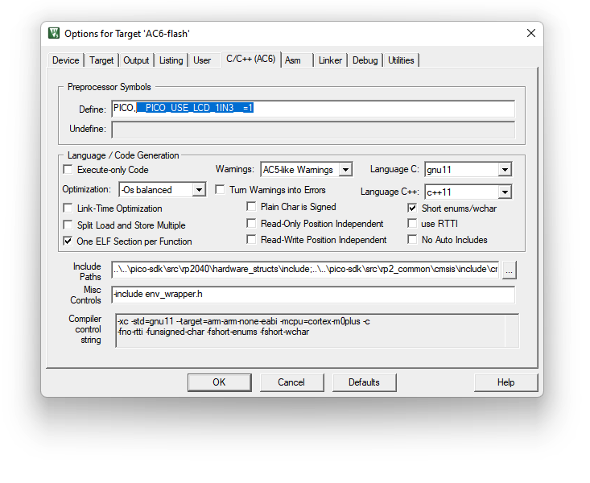

# Pico_Template (v2.0.0)
An MDK template for Raspberry Pi Pico

- **[new] Add Flash Programming algorithm. **

  - **Special Thanks to [Aladdin-Wang](https://github.com/Aladdin-Wang)**, his great efforts makes our life much easier!

- **Support the latest pico-sdk (v1.5.0)**

- Compiler: Arm Compiler 6.15 and above (Using non-intrusive wrapper to support pico-sdk which is written in GCC)

- Add support for popular [LCD 1.3inc module](https://www.waveshare.com/wiki/Pico-LCD-1.3) 

- Support an ultra-lightweight python VM: [PikaScript](https://github.com/pikasTech/pikascript) (via cmsis-pack)

- Compatible with CMSIS 5.7.0, CMSIS 5.8.0 and above

- Verified with Arm Compiler 6.15 and above.

- Provide users an option to use the ***stdio*** solution from ***pico-sdk (by default)*** or retarget the ***stdin/stdout*** to a user specified location directly. (See note in ***env_wrapper.c***).

- **Support Debug in MDK**

  - [Using CMSIS-DAP](https://github.com/majbthrd/pico-debug) (Validated in MDK and **highly recommended**)
  - **Support Flash Downloading**

- Add dedicated project configurations for:
  - [**AC6-flash**] Running code in Flash (XIP)

  - [**AC6-RunInSRAM**] Running code in SRAM (code is still stored in FLASH)

  - [**AC6-DebugInSRAM**] "no_flash" mode in the original pico-sdk.

    


# How to Use

## 1. Get the Pico_Template

I assume that you have the MDK installed on your PC. Please clone the Pico_Template with following command line:

```
mkdir pico-mdk
cd pico-mdk

git clone https://github.com/GorgonMeducer/Pico_Template .

git submodule update --init
```

Instead of using git clone, if you download a release package, then you have to download the [pico-sdk](https://github.com/raspberrypi/pico-sdk) manually and put them into the corresponding folder:

| submodules | URL                                     | Directory      |
| ---------- | --------------------------------------- | -------------- |
| pico-sdk   | https://github.com/raspberrypi/pico-sdk | ROOT\Pico-sdk\ |

The project template also depends on [perf_counter](https://github.com/GorgonMeducer/perf_counter) which is deployed with a **cmsis-pack** that you can find in the root folder. 


## 2. Use the Template

The MDK project could be found in the path "ROOT\project\mdk". I assume you know how to use MDK for normal compilation. 

### 2.1 How to set the Stack and Heap size

Usually, people want to adjust the size of stack and heap, and it is very easy in this template. Please find the file "RP2040.sct" in the same MDK project directory. Find the macro ***STACK_0_SIZE*** for stack and ***HEAP_0_SIZE*** for the heap.  


```
#define STACK_0_SIZE        (1024*4)
#define STACK_1_SIZE        (1024*1)

#define HEAP_0_SIZE         (1024*32)
#define HEAP_1_SIZE         (1024*1)
```

***NOTE***: 

1. Please do **NOT** add "**u**" behind those constant values. 
2. The STACK_1_SIZE and HEAP_1_SIZE are not in use. You can set their value to reasonable smaller ones if you do want to reduce the RAM footprint. 


### 2.2 How to retarget stdout/stdin

To take advantage of pico-sdk, this template uses bridges to retarget low level functions of stdout/stdin to _read and _write implemented by stdio.c inside pico-sdk.  

```
/*----------------------------------------------------------------------------*
 * bridge the Arm Compiler's stdio and the pico-sdk's stdio                   *
 *----------------------------------------------------------------------------*/
__attribute__((weak))
int stdin_getchar(void)
{
    /*! \note If you don't want to use pico-sdk stdio, then you can implement 
     *!       function by yourself in other c source code. Your scanf will work
     *!       directly.
     *!       by default, we use this function to bridge the _read implemented 
     *!       in stdio.c of pico-sdk
     */
    
    int byte;
    _read(0, (char *)&byte, 1);
    return byte;
}

__attribute__((weak))
int stdout_putchar(int ch)
{
    /*! \note If you don't want to use pico-sdk stdio, then you can implement 
     *!       function by yourself in other c source code. Your printf will work
     *!       directly.
     *!       by default, we use this function to bridge the _write implemented 
     *!       in stdio.c of pico-sdk
     */
    
    return _write(1, (char *)&ch, 1);
}

```

Those bridge functions are decorated as "weak", hence if you want to retarget ***printf/scanf*** directly to a place where you can "***see through***" and/or ***you have total control***, please implement those bridge functions (without delete the weak version) in one of your c source code, for example, sending chars to USART or storing them to a memory block directly. 

**NOTE**: I try to provide you the freedom of choice, and I don't need you to digging deep inside scripts to gain such freedom. 


When using configuration**AC6-DebugInSRAM-printf**, all ***printf*** output is retargeted to '**Debug (printf) Viewer**' inside MDK (as shown below) with the help from EventRecorder.

 


### 2.3 How to debug using pico-debug (CMSIS-DAP)

[Pico-debug](https://github.com/majbthrd/pico-debug) is an open-source project which turns one Cortex-M0+ core in RP2040 into a CMSIS-DAP adapter. It means that without an extra one, you can debug a Pico in MDK with just one USB connector. In order to do so, please [download the latest uf2 file](https://github.com/majbthrd/pico-debug/releases) first.


Pico-Template provides a dedicated project configuration for downloading and debugging code in SRAM. This is the most convenient one and it delivers the best development experience among the three configurations. To use it, please follow the steps below:

1. Boot the Pico with the BOOTSEL button pressed. 
2. Drag and drop **pico-debug-gimmecache.uf2 **to RPI-RP2 mass-storage driver in the explorer. It immediately reboots as a CMSIS-DAP adapter. Pico-debug loads as a RAM only .uf2 image, meaning that it is never written to flash and doesn't replace existing user code.
3. Compile and Debug
5. Enjoy...

**NOTE: **

**1. In this mode, the "RESET" doesn't really work as we expect. If you do want to RESET, please press the "Reset Pico " button shown below:**

 

**2. If you cannot find this Toolbox, please start your debug session and go to menu "View"->"Toolbox Window".**


### 2.4 How to enable support for the LCD 1.3inc Module

To make it easier for people to turn Pico into a 'game pad', I've picked a popular [1.3inc LCD module](https://www.waveshare.com/wiki/Pico-LCD-1.3) and added a tailored driver into this Pico template. 

In brief,  it is an

>  1.3inch LCD Display Module For Raspberry Pi Pico, 65K RGB Colors, 240×240 Pixels, SPI Interface

 

 To enable the built in support, please set the macro `__PICO_USE_LCD_1IN3__` to `1` in MDK project configuration as shown below:

 

After that, you can 

- Use the API `GLCD_DrawBitmap()` to flush a display buffer to the 1.3 inch LCD fully or partially (with specified location and size).

```c
extern 
void GLCD_DrawBitmap(   int_fast16_t x, int_fast16_t y, 
                        int_fast16_t width, int_fast16_t height,
                        uint16_t *frame_ptr);
```

- Use the API `dev_read_key()` to read the key status of the 1.3 inch LCD board:

```c
enum {
    PIN_KEY_A       = 15,
    PIN_KEY_B       = 17,
    PIN_KEY_X       = 19,
    PIN_KEY_Y       = 21,
    PIN_KEY_UP      = 2,
    PIN_KEY_DOWN    = 18,
    PIN_KEY_LEFT    = 16,
    PIN_KEY_RIGHT   = 20,
    PIN_KEY_HOME    = 3, 

    KEY_HOME        = 0,
    KEY_UP          = 1,
    KEY_DOWN,
    KEY_LEFT,
    KEY_RIGHT,
    KEY_A,
    KEY_B,
    KEY_X,
    KEY_Y,
    KEY_NUM,
};

bool dev_read_key(uint8_t chkey);
```

For example:

```c
#include "DEV_Config.h"

...
//! read key A
if (dev_read_key(KEY_A)) {
    printf("Key A is down \r\n");
}
...
```


### 2.5 How to enable the PikaScript Support

> PikaScript is an ultra-lightweight Python engine with zero dependencies and zero-configuration, that can run with 4KB of RAM and 32KB of flash (such as STM32G030C8 and STM32F103C8).

Pico-Template supports [PikaScript](https://github.com/pikasTech/pikascript) via cmsis-pack which you can find in the root directory. After the installation, please following the [official guidance](https://pikadoc.readthedocs.io/en/latest/get-start_cmsis-pack.html) to enable the support. 

**NOTE**: The first time compilation after ***selecting the Before Build/Rebuild*** might takes a longer time than you thought. 

 

# Known issue

- Not all peripheral modules are added to the compilation. But I guess it is just a piece of cake for you : P

- ***Please use the elf2uf2 tool in this template*** to convert the generated axf into uf2.

- Might need more documents...

